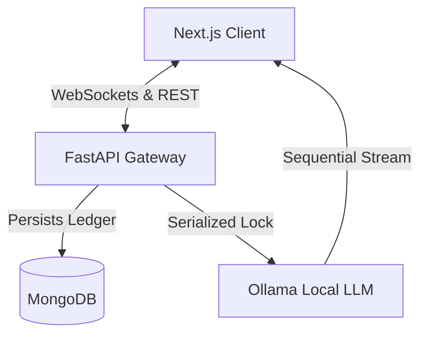
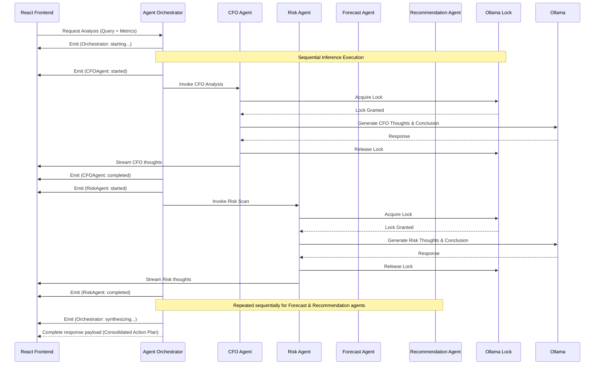

# FinSight AI — Autonomous CFO Operating System

FinSight AI is a next-generation autonomous financial intelligence platform. Designed as a unified single-page cockpit, it features real-time bank gateway ledger ingestion, instant anomaly detection, and a sequential multi-agent orchestration pipeline (CFO, Risk, Forecast, Recommendation) powered by local LLMs (Ollama).

---

## Executive System Brief

FinSight AI functions as an autonomous, real-time command console for corporate financial operations. The system bridges the gap between raw ledger transaction streams and multi-perspective executive intelligence:

1. **Transaction Ingestion & Risk Scoring**: The system continuously processes bank ledger feeds, running them through local machine-learning anomaly detection algorithms to identify potential payment risks and duplicates in under 100ms.
2. **Sequential Multi-Agent Orchestration**: Rather than triggering parallel independent LLM calls, the platform serializes requests through a system-wide execution lock (`ollama_lock`). Four expert agents (CFO, Risk, Forecast, Recommendation) evaluate the situation in a unified reasoning chain, streaming status logs sequentially.
3. **Unified Single-Page Cockpit**: The UI acts as a single-screen command center. The permanent chatbot pane on the left can actively update, command, and toggle the active system views on the right (Dashboard, Simulator, Risk Radar, and Reports) in response to conversational prompts.

---

## Key Capabilities

*   **Unified Financial Cockpit**: A single-screen workspace where conversational CFO intelligence sits permanently next to interactive, command-responsive system tabs (Dashboard, Financial Twin, Risk Radar, Reports, Settings).
*   **Real-time Bank Gateway Ingestion**: High-throughput REST API that performs automated anomaly score calculation, persists transactions to MongoDB, and streams updates instantly to WebSocket clients.
*   **Sequential Multi-Agent Orchestration**: A serialized reasoning pipeline where specialized agents analyze variance, calculate runway, forecast time-series models, and construct action roadmaps step-by-step.
*   **Interactive Financial Twin**: A simulator that lets users project simulated scenarios (e.g., headcount growth, expense hikes, revenue gains) to test impact on runway and overall corporate health.
*   **Visual Risk Radar**: Real-time classification of anomalous activity, alerting founders to security threats, duplicate billings, and suspicious transactions.

---

## System Architecture



---

## Detailed Agent Flow Setup

FinSight AI utilizes a structured, serialized multi-agent orchestration architecture to compile unified financial diagnostic results.



### Agent Roles & Specifications
1. **CFO Agent**: Analyzes overall financial variance, calculates cash burn, interprets standard metrics, and parses custom user-directed queries.
2. **Risk Agent**: Scans cash runway, flags burn-rate warning thresholds, analyzes vendor dependency concentration, and performs health diagnostic scoring.
3. **Forecast Agent**: Evaluates monthly time-series ledger aggregates to project cash-flow forecasts and runway viability.
4. **Recommendation Agent**: Synthesizes diagnostic inputs and risk data to formulate cost-saving adjustments and strategic business roadmaps.

### Sequential Execution & Lock System (`ollama_lock`)
To prevent concurrent requests from overloading local hardware running Ollama inference, the orchestrator implements a serialized lock pattern:
* **Location**: `backend/app/agents/orchestrator.py`
* **Mechanism**:
  ```python
  # Global synchronization lock
  ollama_lock = asyncio.Lock()

  async def _query_ollama_agent(system_prompt: str, user_prompt: str) -> Optional[dict]:
      # Serializes access to local LLM inference across all agents
      async with ollama_lock:
          response = await client.generate(model="qwen3:14b", ...)
  ```
This ensures that only one local LLM inference call is active system-wide at any given moment, preventing GPU/CPU memory thrashing.

---

## Tech Stack

### Backend (Python/FastAPI)
*   **FastAPI**: Async REST & WebSocket server.
*   **Motor (MongoDB)**: Async ODM for database interactions.
*   **Scikit-Learn**: Local transaction anomaly calculation.
*   **Pydantic v2**: Model validation and serialization.

### Frontend (TypeScript/Next.js)
*   **Next.js 16 (Turbopack)**: App Router structure.
*   **TailwindCSS**: Premium responsive styles.
*   **Lucide React**: Vector status and indicator icons.
*   **Framer Motion**: Smooth entry animations and micro-interaction states.

---

## Installation & Setup

### Prerequisites
*   **MongoDB**: Run a local instance on `mongodb://localhost:27017`
*   **Ollama**: Install and download `qwen3:14b` (or set custom fallbacks in backend configuration)

### 1. Backend Configuration
1. Navigate to the backend directory:
    ```bash
    cd backend
    ```
2. Create a virtual environment:
    ```bash
    python -m venv venv
    venv\Scripts\activate
    ```
3. Install dependencies:
    ```bash
    python -m pip install -r requirements.txt
    ```
4. Start the backend server:
    ```bash
    python run.py
    ```
    *The API will be available at `http://localhost:8000`.*

### 2. Frontend Configuration
1. Navigate to the frontend directory:
    ```bash
    cd ../frontend
    ```
2. Install dependencies:
    ```bash
    npm install
    ```
3. Start the development server:
    ```bash
    npm run dev
    ```
    *The console will be accessible at `http://localhost:3000` (or `http://127.0.0.1:3000`).*

---

## API & Streaming Endpoints

### Ingest Transactions (REST API)
*   **Endpoint**: `POST http://localhost:8000/api/v1/financials/transactions/create`
*   **Payload**:
    ```json
    {
      "company_id": "YOUR_COMPANY_ID",
      "description": "Office rent payment",
      "category": "Rent & Facilities",
      "amount": -75000.0
    }
    ```

### Streaming Websockets
*   **Ledger Stream**: `ws://localhost:8000/ws/transactions?company_id=YOUR_ID`
*   **Agent stream**: `ws://localhost:8000/ws/agents?company_id=YOUR_ID`

---

## Troubleshooting

### 1. `Fatal error in launcher: Unable to create process...`
If you encounter a launcher error when running `pip`, it indicates a broken Python environment path configuration. Bypass the launcher by calling the Python executable module wrapper directly:
```bash
python -m pip install -r requirements.txt
```

### 2. Next.js HMR or Font Blocked Warnings
If Next.js logs cross-origin warning messages in the developer console:
*   Open `frontend/next.config.ts`.
*   Ensure `allowedDevOrigins` includes the origin (e.g. `127.0.0.1` or `localhost:3000`) you are currently accessing.

### 3. Ollama Connection Issues
On Windows, connection targets sometimes fail to resolve if localhost attempts IPv6 binding. If agents time out or return rule fallback content, check `backend/app/core/config.py` and specify `http://127.0.0.1:11434` instead of `localhost`.
